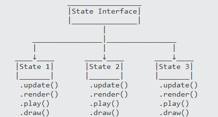

<h1 align="center">
	<a href="https://github.com/KeyC0de/StatePattern">State Pattern</a>
</h1>
<hr>


This is a demonstration of the State Design Pattern in C++ with a groovy example that sticks (hopefully).

The state pattern allows an object to alter its behavior at runtime when its internal state changes. It is conceptually similar to finite-state machines. An alternative to the Strategy pattern, which is able to switch a strategy through invocations of methods defined in the pattern's interface. In fact, the state pattern allows an object to be modeled as a state machine.

<p style="text-align: center;">
	
</p>

Design

- State Interface: Defines an interface for encapsulating the behavior associated with a particular state of the context.
- State: each concrete state implements the state interface's behavior.
- Context: maintains the data of the current state.
- we define a fixed set of states that the class can be in.
- the class can be in only one state at a time.
- the class starts from a default state.
- various conditions can trigger the transition from one state to another. Changing states changes the behavior of the class (at runtime).

Note that when the object's internal state changes it will look to the outside world as if the class is changed.

Enumerations prove to be quite useful for the selection of states. For example:

```
enum class State
{
	STANDING,
	JUMPING,
	DUCKING,
	DIVING,
	SWIMMING
};

class Hero
{
	State m_currentState;

	void handleInput()
	{
		switch(m_currentState)
		{
		case STANDING:
			// do this
			break;
		case JUMPING:
			// do that
			break;
		// ...
		default:
			// do w/e
			break;
		}
	}
	// ...
};
```

I used Windows 8.1 x86_64, Visual Studio 2017, C++17 to build the project.


# Contribute

Please submit any bugs you find through GitHub repository 'Issues' page with details describing how to replicate the problem. If you liked it or you learned something new give it a star, clone it, contribute to it whatever. Enjoy.


# License

Distributed under the GNU GPL V3 License. See "GNU GPL license.txt" for more information.


# Contact

email: *nik.lazkey@gmail.com*</br>
website: *www.keyc0de.net*
